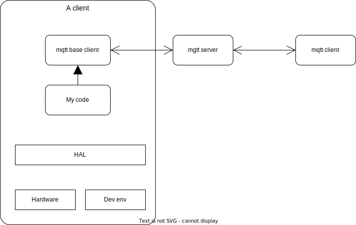

# MyPerfectProject
This project will demonstrate how to build a stabil IoT framework that shall be easy to extand and also develop. When using the framework it shall be easy to create high quality software, from design, dvceleoping with unit test and also do intigrationtest and finaly productioon test.
All know that you should find defects early during the development, so with this framework and developing method it shall be easy to fins defects early in the development phase.

The framewok make it easy to create anm IoT product or system, with that i mean that the system shall contaion small units that have only one purpus and all units are connected with each other with the mqtt protocoll, but the framework will hide the protocoll for the user and only use some function in the baseclass [see base class implementation](mqtt_client.py).

All signals and messages that will be used in the system shall be defined in a xml file. A tool included in this project will create and implementation of the interface that shall be used when comunicate between IoT nodes.

To make it possibly to do integration test in a virtual environment we will have a HAL (Harwdare Abstraction Layer) to simulate the hardware during integration test in the virtual environment.





# Create a client
This i a tutorial how to create a IoT client, firts you create the base code for the client, as you can see the class name will be used as the client name, the classname is used when craete mqtt_client construction, you can chaneg the name if you wish.

```python
from mqtt_client import mqtt_client


class my_client(mqtt_client):
    def __init__(self):
        mqtt_client.__init__(self, self.__class__.__name__)


if __name__ == '__main__':
    my_client = my_client()
    
    my_client.run()
```
## Define the interface
Next we have to define the interafce for this modul, the interface is defined in the [interface file](./mqtt_topic.xml).

Interface for the modul shall be all ingoing and outgoing message the this modul owm, that mean that only this modul need this message or produce those messages/data

```xml
<messsage>
    <time_start message="start" type="date_time"/>
    <time_ten_yard message="ten_yard" type="date_time"/>
    <time_twenty_yard message="twenty_yard" type="date_time"/>
    <time_thirty_yard message="thirty_yard" type="date_time"/>
    <time_fourty_yard message="fourty_yard" type="date_time"/>
    <reset> 
        <value message="value" type="int"/>
        <counter message="counter" type="int"/>
    </reset>
</message>
```

Each defined message/data will be generated as a class in python, those classes will have following methods

### publish
Publish is used when 
### subscribe

## Setup the client
